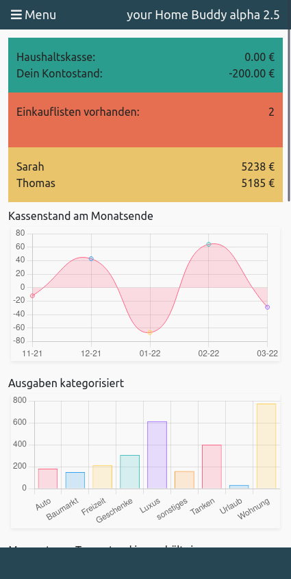
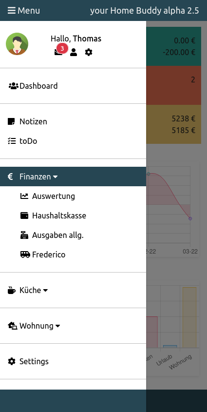
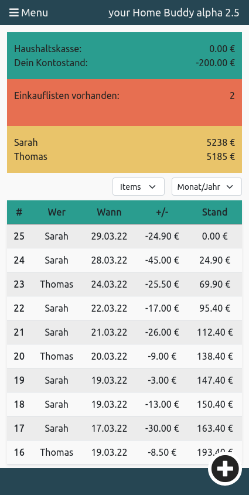
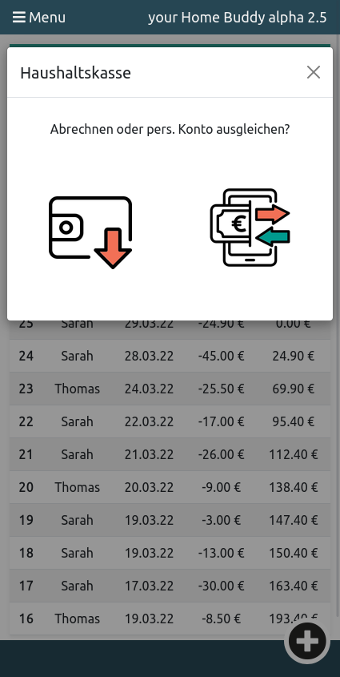
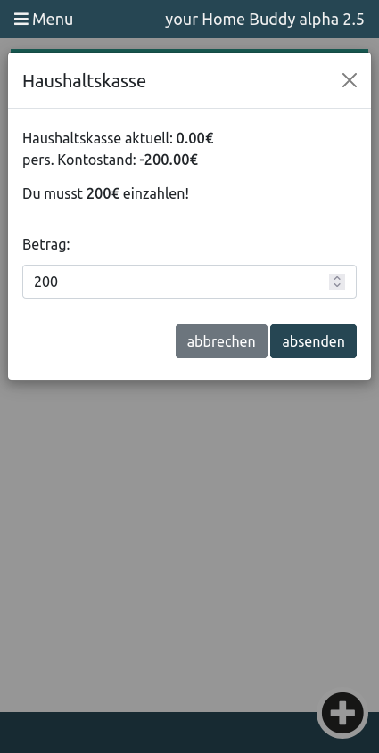
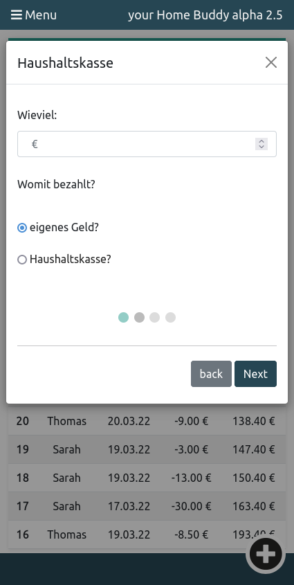

# homeBuddy

## Aktuelles Freizeit Projekt als Arbeitsprobe für die dotSource GmbH

Die Alpha-Version verfügt über alle grundlegenden Funktionen. Zukünftig sollen diese noch ausgebaut werden. Der Code sieht zwar ein wenig wild aus, spiegelt aber meinen Entwicklungsfortschritt wieder. Ich versuche immer neu Gelerntes einfließen zu lassen oder Module neu zu schreiben, um dadurch fortlaufend etwas mehr Struktur reinzubringen. 

Am Anfang habe ich doch ein paar strukturelle Fehler eingebaut, die ich neu schreiben müsste. Da das aktuell neben meiner Vollzeitbeschäftigung etwas zu zeitaufwendig wäre, ziehe ich das ganze Projekt aktuell in Laravel neu auf. Ich erachte es als wichtig, mindestens ein PHP-Framework zu beherrschen. Daher passt der Zeitpunkt gut, um beides miteinander zu verbinden.

  
  
  

  
  
  

